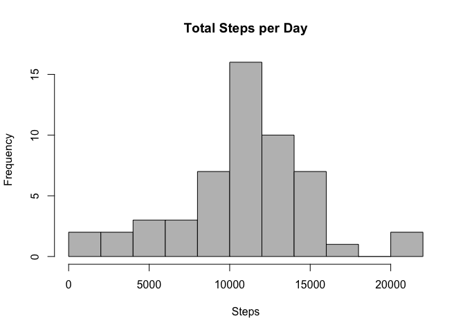
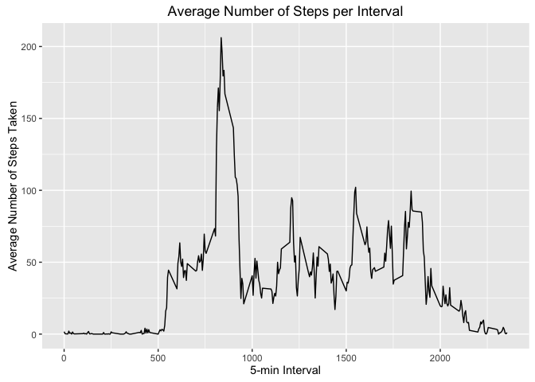
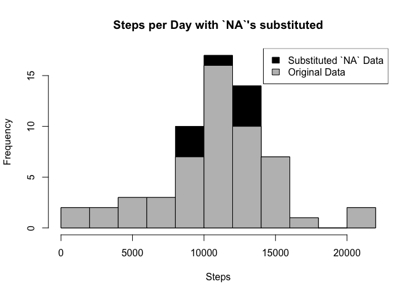
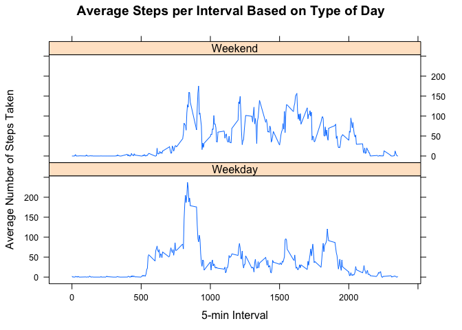

# Reproducible Research: Peer Assessment 1
Alexandra Yakovleva  
May, 2016  

## Introduction
It is now possible to collect a large amount of data about personal movement using activity monitoring devices such as a [Fitbit](http://fitbit.com ), [Nike](http://nike.com ), [Fuelband](http://fuelband.com), or [Jawbone Up](http://jawbone.com/up). These type of devices are part of the “quantified self” movement – a group of enthusiasts who take measurements about themselves regularly to improve their health, to find patterns in their behavior, or because they are tech geeks. But these data remain under-utilized both because the raw data are hard to obtain and there is a lack of statistical methods and software for processing and interpreting the data.

This assignment makes use of data from a personal activity monitoring device. This device collects data at 5 minute intervals through out the day. The data consists of two months of data from an anonymous individual collected during the months of October and November, 2012 and include the number of steps taken in 5 minute intervals each day.

***

## Data Handbook
The data for this assignment can be downloaded from the course web site:

* Dataset: [Activity monitoring data [52K]](https://d396qusza40orc.cloudfront.net/repdata%2Fdata%2Factivity.zip )

The variables included in this dataset are:

* **steps**: Number of steps taking in a 5-minute interval (missing values are coded as `NA`)
* **date**: The date on which the measurement was taken in YYYY-MM-DD format
* **interval**: Identifier for the 5-minute interval in which measurement was taken

The dataset is stored in a comma-separated-value (CSV) file and there are a total of 17,568 observations in this dataset.

***

## Loading and preprocessing the data

1. Load the data (i.e. `read.csv()`)


```r
if(!file.exists("activity.zip")) {
        temp <- tempfile()
        download.file("http://d396qusza40orc.cloudfront.net/repdata%2Fdata%2Factivity.zip",temp)
        unzip(temp)
        unlink(temp)
}
unzip("activity.zip")
dataActivity <- read.csv("activity.csv")
head(dataActivity)
```

```
##   steps       date interval
## 1    NA 2012-10-01        0
## 2    NA 2012-10-01        5
## 3    NA 2012-10-01       10
## 4    NA 2012-10-01       15
## 5    NA 2012-10-01       20
## 6    NA 2012-10-01       25
```

2. Process/transform the data (if necessary) into a format suitable for your analysis


```r
dataActivity$day <- weekdays(as.Date(dataActivity$date))
dataActivity$DateTime<- as.POSIXct(dataActivity$date, format="%Y-%m-%d")
```

***

## What is mean total number of steps taken per day?

1. Calculate the total number of steps taken per day


```r
daySteps <- aggregate(steps ~ date, dataActivity, sum)
```

2. Make a histogram of the total number of steps taken each day


```r
hist(daySteps$steps, breaks=10, xlab="Steps", main = "Total Steps per Day", col="Grey")
```

<!-- -->

3. Calculate and report the mean and median of the total number of steps taken per day


```r
## Average step count
as.integer(mean(daySteps$steps))
```

```
## [1] 10766
```


```r
## Median step count
as.integer(median(daySteps$steps))
```

```
## [1] 10765
```

***

## What is the average daily activity pattern?

1. Make a time series plot (i.e. `type = 1`) of the 5-minute interval (x-axis) and the average number of steps taken, averaged across all days (y-axis)


```r
library(plyr)
library(ggplot2)

##pulling data without nas
dataClean <- dataActivity[!is.na(dataActivity$steps),]

##Calculate average number of steps per interval.
intervalStepsTable <- ddply(dataClean, .(interval), summarize, avg = mean(steps))

##Line plot of average number of steps per interval.
p <- ggplot(intervalStepsTable, aes(x=interval, y=avg), xlab = "5-min Interval", ylab="Average Number of Steps Taken")
p + geom_line()+xlab("5-min Interval")+ylab("Average Number of Steps Taken")+ggtitle("Average Number of Steps per Interval")
```

<!-- -->

2. Which 5-minute interval, on average across all the days in the dataset, contains the maximum number of steps?


```r
##Which interval contains the maximum average number of steps?
maxAvSteps <- intervalStepsTable[intervalStepsTable$avg == max(intervalStepsTable$avg), 1]
maxAvSteps
```

```
## [1] 835
```
Inverval 835 contains the maximum average number of steps.

***

## Imputing missing values

Note that there are a number of days/intervals where there are missing values (coded as `NA`). The presence of missing days may introduce bias into some calculations or summaries of the data.

1. Calculate and report the total number of missing values in the dataset (i.e. the total number of rows with `NA`'s).


```r
##Number of NAs in the original data set
nrow(dataActivity[is.na(dataActivity$steps),])
```

```
## [1] 2304
```

2. Devise a strategy for filling in all of the missing values in the dataset. The strategy does not need to be sophisticated. For example, you could use the mean/median for that day, or the mean for that 5-minute interval, etc.

We'll substitute the `NA` values with the mean 5-minute interval based on the day of the week.


```r
meanValues <- ddply(dataClean, .(interval, day), summarize, avg = mean(steps))
## Create dataset with all NAs for substitution
dataNA<- dataActivity[is.na(dataActivity$steps),]
head(dataNA)
```

```
##   steps       date interval    day   DateTime
## 1    NA 2012-10-01        0 Monday 2012-10-01
## 2    NA 2012-10-01        5 Monday 2012-10-01
## 3    NA 2012-10-01       10 Monday 2012-10-01
## 4    NA 2012-10-01       15 Monday 2012-10-01
## 5    NA 2012-10-01       20 Monday 2012-10-01
## 6    NA 2012-10-01       25 Monday 2012-10-01
```

```r
##Merge the NA averages and non NA data together
dataSub <- merge(dataNA, meanValues, by = c("interval", "day"))
head(dataSub)
```

```
##   interval      day steps       date   DateTime      avg
## 1        0   Friday    NA 2012-11-09 2012-11-09 0.000000
## 2        0   Friday    NA 2012-11-30 2012-11-30 0.000000
## 3        0   Monday    NA 2012-10-01 2012-10-01 1.428571
## 4        0   Monday    NA 2012-10-08 2012-10-08 1.428571
## 5        0 Saturday    NA 2012-11-10 2012-11-10 0.000000
## 6        0   Sunday    NA 2012-11-04 2012-11-04 0.000000
```

3. Create a new dataset that is equal to the original dataset but with the missing data filled in.


```r
## Rearrange the columns in sub data 
head(dataClean)
```

```
##     steps       date interval     day   DateTime
## 289     0 2012-10-02        0 Tuesday 2012-10-02
## 290     0 2012-10-02        5 Tuesday 2012-10-02
## 291     0 2012-10-02       10 Tuesday 2012-10-02
## 292     0 2012-10-02       15 Tuesday 2012-10-02
## 293     0 2012-10-02       20 Tuesday 2012-10-02
## 294     0 2012-10-02       25 Tuesday 2012-10-02
```

```r
dataSubOrd <- dataSub[,c(6,4,1,2,5)]
colnames(dataSubOrd) <- colnames(dataClean)
#Merge the clean data with substituted data, 
dataMerged <- rbind(dataClean, dataSubOrd)
head(dataMerged)
```

```
##     steps       date interval     day   DateTime
## 289     0 2012-10-02        0 Tuesday 2012-10-02
## 290     0 2012-10-02        5 Tuesday 2012-10-02
## 291     0 2012-10-02       10 Tuesday 2012-10-02
## 292     0 2012-10-02       15 Tuesday 2012-10-02
## 293     0 2012-10-02       20 Tuesday 2012-10-02
## 294     0 2012-10-02       25 Tuesday 2012-10-02
```

4. Make a histogram of the total number of steps taken each day and calculate and report the **mean** and **median** total number of steps taken per day. Do these values differ from the estimates from the first part of the assignment? What is the impact of imputing missing data on the estimates of the total daily number of steps?


```r
## Create sum of steps per date to compare with step 1
dayStepsSub <- aggregate(steps ~ date, dataMerged, sum)

## Mean steps with substituted NA values
as.integer(mean(dayStepsSub$steps)) 
```

```
## [1] 10821
```

```r
## Median steps with substituted NA values
as.integer(median(dayStepsSub$steps))
```

```
## [1] 11015
```

```r
## Creating the histogram of total steps per day, categorized by data set to show impact

hist(dayStepsSub$steps, breaks=10, xlab="Steps", main = "Steps per Day with `NA`'s substituted", col="Black")
hist(daySteps$steps, breaks=10, xlab="Steps", main = "Steps per Day without `NA`'s", col="Grey", add=T)
legend("topright", c("Substituted `NA` Data", "Original Data"), fill=c("black", "grey") )
```

<!-- -->

Difference between average step count in substituted and original dataset:


```r
## Difference in mean step count with NA and with sub stituted values
diffAvg <- as.integer(mean(dayStepsSub$steps)) - as.integer(mean(daySteps$steps)) 
diffAvg
```

```
## [1] 55
```

```r
## Percent increase
avgPercentIncrease <- 100*abs(diffAvg)/as.integer(mean(dayStepsSub$steps))
avgPercentIncrease
```

```
## [1] 0.508271
```

Difference between median step count in substituted and original dataset:

```r
## Median steps with NA values
diffMed <- as.integer(median(dayStepsSub$steps)) - as.integer(median(daySteps$steps))
diffMed
```

```
## [1] 250
```

```r
## Percent increase
medPercentIncrease <- 100*abs(diffMed)/as.integer(median(dayStepsSub$steps))
medPercentIncrease
```

```
## [1] 2.269632
```

Histogram shows visible increase for steps per day in ranges [8000-10000] and [12000-14000] and slight impact for [10000-12000], however the total percent increase was insignificant.

***
## Are there differences in activity patterns between weekdays and weekends?

1. Create a new factor variable in the dataset with two levels – “weekday” and “weekend” indicating whether a given date is a weekday or weekend day.


```r
# Create weekday/weekend category column
dataMerged$daycategory <- ifelse(dataMerged$day %in% c("Saturday", "Sunday"), "Weekend", "Weekday")
```

2.Make a panel plot containing a time series plot (i.e. "type = 1") of the 5-minute interval (x-axis) and the average number of steps taken, averaged across all weekday days or weekend days (y-axis). See the README file in the GitHub repository to see an example of what this plot should look like using simulated data.


```r
library(lattice) 

## Summarize data by interval and day category 
intervalTableDay <- ddply(dataMerged, .(interval, daycategory), summarize, avg = mean(steps))

##Plot data in a panel plot
xyplot(avg~interval|daycategory, data=intervalTableDay, type="l",  layout = c(1,2),
       main="Average Steps per Interval Based on Type of Day", 
       ylab="Average Number of Steps Taken", xlab="5-min Interval")
```

<!-- -->
